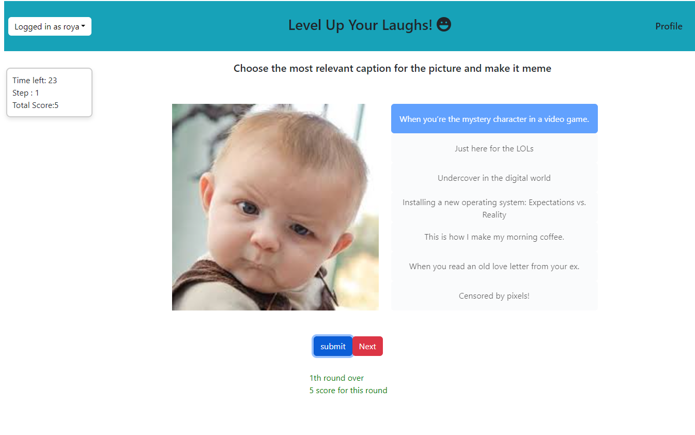
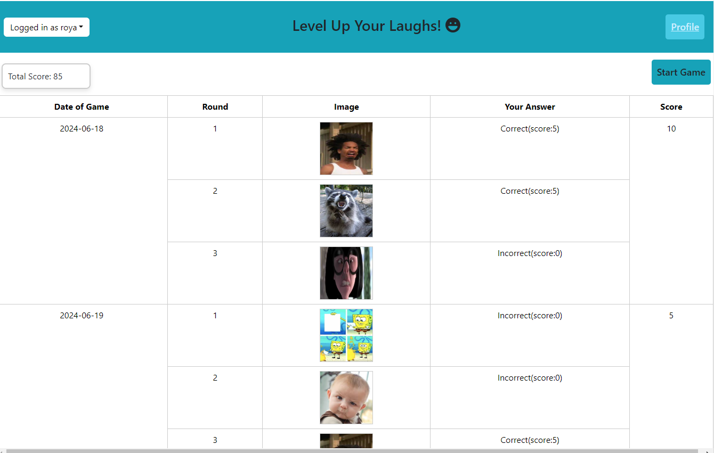

# Exam #N: "Meme Game"

## Student:Hosseinpour Roya

## React Client Application Routes

- Route `/`: This is the homepage of the application, served by the FirstPage component. It provides the initial interaction point for users, offering options to start the game or log in based on their authentication status.

- Route `/login`: This route leads to the login page. It is used when the 'Login' button in the `Header` component is clicked by unauthenticated users. The purpose of this page is to allow users to authenticate themselves to access personalized features of the application.

- Route `/profile`: Accessible by clicking on the 'Profile' link in the `Header` component dropdown menu for authenticated users.Users can access this page to view their historical game data, including details of past games such as the date of the game, rounds, images used, answers provided, and scores obtained. The page provides a comprehensive view of the user's performance over time.

- Route `/logout`: Although not a visible route, this action is triggered when the 'Logout' dropdown item in the `Header` component is selected by an authenticated user. It handles the user's logout process, clearing their session and redirecting them to the homepage or login page.

- Route `/startGame`: This route leads to the game page, which is handled by the `StartGame` component. Users can access this page to participate in the meme caption game. The page provides a dynamic

- Route `/result`: This route leads to the results page, which is handled by the `Result` component. Users can access this page to view the summary and results of their game session. The page displays each meme used during the game, the correct captions for each, and the total score achieved by the player.

- Route `/oneRound`: This route leads to the gameplay page for a single round, which is handled by the `oneRound` component. Users can access this page to participate in a single round of the meme caption game. The page facilitates the gameplay where users view a meme, select from a list of possible captions, and submit their choice to earn points based on the correctness of their selection.

## Main React Components

`App` (in `App.jsx`): This is the main component of the application. It handles the routing and state management at the top level. It is exported as the default module, which allows it to be easily imported in other parts of the application using any desired name.

- **Functionality**: Manages routes and global state using React Router and Context API. Provides the structure for the page and includes other components like `Header`, and various page components depending on the route.

- **File Location**: `client/src/components/FirstPage.jsx`
- **Purpose**: The `FirstPage` component serves as the landing page of the Meme Game application. It provides users with the option to start the game withouth log in for one round game or log in .
- **Functionality**:
  - Displays a welcoming message.
  - Provides links to start the game immediately or after logging in, depending on whether the user is already authenticated.
- **Props**:
  - `user`: A user object that determines if the user is logged in. If `user` is present, the game starts directly; otherwise, options to log in or play a single round without logging in are presented.
- **Usage**:

  - This component is used as the main entry point for users visiting the site.

- **File Location**: `client/src/components/Header.jsx`
- **Purpose**: The `Header` component acts as the navigation bar of the application, adjusting its content based on the user's authentication status.
- **Functionality**:
  - For authenticated users, it displays the user's name and provides dropdown options for 'Profile' and 'Logout'.
  - For unauthenticated users, it displays a 'Login' button to facilitate access to the login page.
- **Props**:
  - `user`: A user object that indicates whether the user is logged in. Depending on the user's status, the header changes its display and options accordingly.
- **Usage**:

  - This component is positioned at the top of every page within the application, providing essential navigation links and user interaction options.

- **File Location**: `client/src/components/logIn.jsx`
- **Purpose**: The `LogIn` component is responsible for handling user authentication. It provides a form where users can enter their email and password to log into the application.
- **Functionality**:
  - Displays a form for email and password input.
  - Handles user login by calling the `logInUser` function from `../Api.js` when the login button is clicked.
  - Displays a message if there is an error or a successful login attempt.
- **Props**:
  - `onHandleLogin`: A function passed from the parent component to handle the login process.
  - `loggedInMessage`: A message to display feedback about the login process (e.g., error or success messages).
  - `user`: A user object that, if present, indicates the user is already logged in and provides links to start the game or go to the profile page.
- **Usage**:

  - This component is used on the login page, which is typically accessed via a link or button from the `Header` component.

- **File Location**: `client/src/components/oneRound.jsx`
- **Purpose**: The `oneRound` component orchestrates the gameplay for a single round of the meme caption game. It manages the display of a meme and a set of captions, allowing users to select and submit their choice to earn points based on accuracy.
- **Functionality**:
  - Fetches a meme and its associated captions from the server at the start of the round.
  - Allows users to select a caption and submit it for verification against the correct answers stored on the server.
  - Displays the result of the submission, indicating whether the selected caption was correct and showing the correct captions if the user's choice was incorrect.
  - Manages a countdown timer for the round, updating the game's state based on the timer's status.
- **Usage**:
  - This component is used when a user plays a single round of the game without log in. It is typically accessed from the game's main menu.
- **State Management**:
  - Manages states for images, captions, selected captions, correctness of the selection, game score, and timer.
- **Effects**:
  - Uses `useEffect` to fetch initial data and manage timer countdown.
- **Navigation**:

  - Uses `useNavigate` from `react-router-dom` to navigate to the results page after the game ends or to log in for more rounds.

- **File Location**: `client/src/components/StartGame.jsx`
- **Purpose**: The `StartGame` component manages the gameplay for 3 rounds of the meme caption game. It handles the display of memes, caption selection, and scoring based on user responses.
- **Functionality**:
  - Fetches new memes and captions from the server at the start of each round.
  - Allows users to select a caption and submit it for verification against the correct answers stored on the server.
  - Manages a countdown timer for each round, updating the game's state based on the timer's status.
  - Displays the result of each round, indicating whether the selected caption was correct and showing the correct captions if the user's choice was incorrect.
  - Accumulates scores and manages transitions between rounds or to the results page at the end of the game.
- **Props**:
  - `onGameFinish`: A function passed from the parent component to handle actions upon the completion of the game, such as displaying final results and scores.
- **Usage**:
  - This component is used when a user initiates a full game session, typically accessed after a user logs in.
- **State Management**:
  - Manages states for images, captions, selected captions, correctness of the selection, game score, timer, and overall game results.
- **Effects**:
  - Uses `useEffect` to fetch initial data, manage timer countdown, and handle game progression.
- **Navigation**:

  - Uses `useNavigate` from `react-router-dom` to navigate to the results page after the game ends.

- **File Location**: `client/src/components/result.jsx`
- **Purpose**: The `Result` component displays the results of the game session, including images used in the game, the correct captions selected by the player, and the total score achieved.
- **Functionality**:
  - Checks if the game results data is available and displays a warning if not.
  - Renders a summary of the game results, showing each meme used in the game along with its correct captions.
  - Displays the total score achieved by the player during the game.
- **Props**:
  - `gameRes`: An object containing the results of the game, including an array of game results and the total score.
- **Usage**:
  - This component is used at the end of a game session to display the results to the user. It is typically accessed after completing all rounds of the game.
- **Navigation**:

  - Provides a link to the user's profile page where they can view their profile or start a new game.

  - **File Location**: `client/src/components/profile.jsx`

- **Purpose**: The `Profile` component displays the historical game data for a user, including scores from past games, the dates those games were played, and the answers provided during each round.
- **Functionality**:
  - Fetches the user's game history from the server when the component mounts.
  - Displays a table summarizing each game's date, round, the image used, the user's answer, and the score for that round.
  - Shows the total score accumulated over all games at the top of the page.
- **Usage**:
  - This component is used to provide users with a detailed view of their past game performances. It helps users track their progress and review their answers.
- **State Management**:
  - Manages state for historical game data and total score using React's useState hook.
- **Effects**:

  - Uses useEffect to fetch historical data from the server upon component mount.

- **Styling for all components**:
  - Uses Bootstrap for the table and responsive layout.
  - Additional custom styles are applied through `App.css` and `index.css`.

## API Server

### Functions

- `loginUser(email, password)`: Authenticates users.

  - **Inputs**: `email` (string), `password` (string)
  - **Output**: Returns user information if authentication is successful, otherwise returns `false`.

- `getImagesAndCaptions(preImageIds)`: Retrieves images and related captions for the game.

  - **Inputs**: `preImageIds` (string) - A comma-separated string of image IDs that should not be included in the results.
  - **Output**: Returns an object containing a random image and a mix of correct and random captions.

- `checkAnswer(user_id, answerId, answerText, imageId)`: Checks if the provided answer is correct for the given image.

  - **Inputs**: `user_id` (optional, string), `answerId` (string), `answerText` (string), `imageId` (string)
  - **Output**: Returns an object indicating whether the answer was correct, along with user and answer details.

- `InsertInfo(data, user)`: Inserts game information into the database.

  - **Inputs**: `data` (object containing game data), `user` (user object)
  - **Output**: Returns the result of the database insertion operation.

- `sendHistory(user)`: Retrieves the game history for a user.

  - **Inputs**: `user` (user object with at least `id` property)
  - **Output**: Returns an array of game rounds with details and overall score.

  ### Routes

- DELETE `/sessions/current`: Logs out the current user.

  - **Response**: Returns an empty object with a `200 OK` status if successful, or `401 Unauthorized` if not authenticated.

- GET `/sessions/current`: Retrieves the current logged-in user's information.

  - **Response**: Returns user information if authenticated with a `200 OK` status, otherwise `401 Unauthorized`.

- POST `/sessions`: Authenticates a user and establishes a session.

  - **Body**: Requires `username` and `password`.
  - **Response**: Returns the authenticated user's information if successful, otherwise returns an error message with a `401 Unauthorized` status.

- GET `/image&captions`: Fetches an image and related captions for the game.

  - **Query Parameters**: `preImageIds` - a comma-separated list of image IDs to exclude.
  - **Response**: Returns an object containing an image and a set of captions with a `200 OK` status.

- POST `/verify-caption`: Verifies if the submitted caption is correct for the given image.

  - **Body**: Requires `captionId`, `text` (caption text), and `imageId`.
  - **Response**: Returns verification result including whether the answer was correct or not with a `200 OK` status.

- POST `/savingInfo`: Saves game information for a logged-in user.

  - **Middleware**: Uses `isLoggin` to ensure the user is authenticated.
  - **Body**: Requires game data.
  - **Response**: Returns the result of the save operation with a `200 OK` status if successful, otherwise an error message.

- GET `/history`: Retrieves the game history for a logged-in user.
  - **Middleware**: Uses `isLoggin` to ensure the user is authenticated.
  - **Response**: Returns an array of game history records with a `200 OK` status if successful, otherwise an error message.

## Database Tables

### Captions Table

- **Table Name**: `captions`
- **Description**: Stores caption data for the meme caption game. Each entry includes a unique `captionId` and a `text` field containing the caption itself. This table is crucial for the game's functionality, as it supplies the captions that players select during gameplay to match with meme images.

### Game Results Table

- **Table Name**: `game_results`
- **Description**: This table stores the results of each game session. Each record includes a `gameId`, a JSON array of `rounds` detailing each round's outcomes (whether the answer was correct and which image was used), the `userId` of the player, the total `score` achieved in the game, and the date the game was `created_at`.

  ### Images Table

- **Table Name**: `images`
- **Description**: This table stores information about the images used in the meme game. Each record includes an `id`, the file path of the `image`, and a list of `captionId`s that are associated with the image. These captions are potential choices for players to match with the image during the game.

### Users Table

- **Table Name**: `users`
- **Description**: This table stores user account information. Each record includes an `id`, `name`, `email`, and security details such as `hash` and `salt` for password protection. This setup enhances security by storing hashed passwords along with a unique salt for each user.

## Screenshots

## Users Credentials

Each user in the system is identified by a unique set of credentials, which include their username, password, and email address. Below are examples of user credentials that can be used for testing or initial setup in development environments:

- **Username**: roya, **Password**: 123, **Email**: roya@gmail.com
- **Username**: nazanin, **Password**: password123, **Email**: nazanin@example.com
- **Username**: Jane, **Password**: securepass, **Email**: jane@example.com
- **Username**: User One, **Password**: userpassword, **Email**: user@example.com
